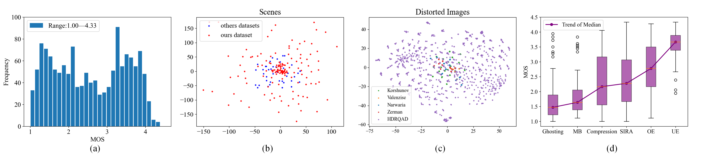
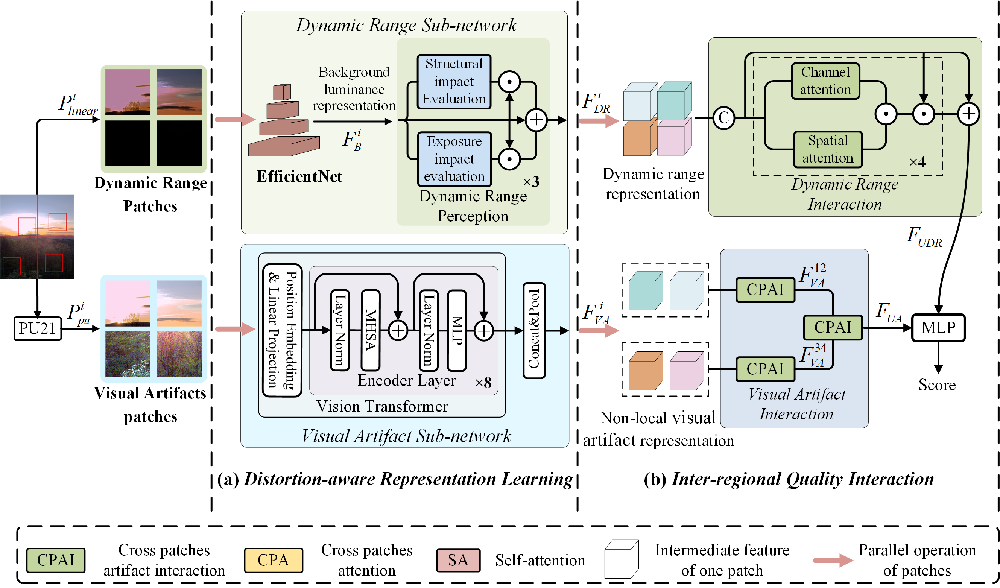

# Perceptual Quality Assessment of High Dynamic Range Image: A Benchmark Dataset and A No Reference Method
## Dataset
We embark on a groundbreaking endeavor to create the HDRQAD for developing a high-quality metrics for HDR IQA. A total of 1,409 distorted HDR images acquired through three imaging schemes, enabling HDRQAD characterized by a high diversity of real distortion types (6 categories) and content (147 scenes). The dataset is uploaded to Baidu Cloud.


Fig.1 Dataset Analysis. (a) Histogram of MOS values in HDRQAD. (b) Scene diversity comparison. (c) Distorted content diversity comparison. Luminance map of original and distorted images are reduced to 2 dimensions using T-SNE. (d) Distribution of MOS values for each type of distortion.
## Network
We design an end-to-end network for HDR IQA, which consists of a DRL module and an IRQI module. The DRL module independently considers distortions in different regions from both dynamic range and HDR visual artifacts perspectives, enhancing the robustness of quality prediction. The IRQI captures inter-regional quality dependencies to improve the accuracy of overall quality assessment. 


<p align="center">
  Fig.2 Framework of the proposed network.
</p>

## Usages
### Testing a single HDR image
Predicting HDR image quality with our model trained on the HDRQAD.
To run the demo, please download the pre-trained model at [Baidu cloud](https://pan.baidu.com/s/1zkz_2iQz1PXWTpFrM2xeaA) (password: acep), put it in 'pretrained' folder, then run:
```python
python demo.py
```
### Training & Testing on HDR IQA databases
The training code will be made publicly available within one month after acceptance.


